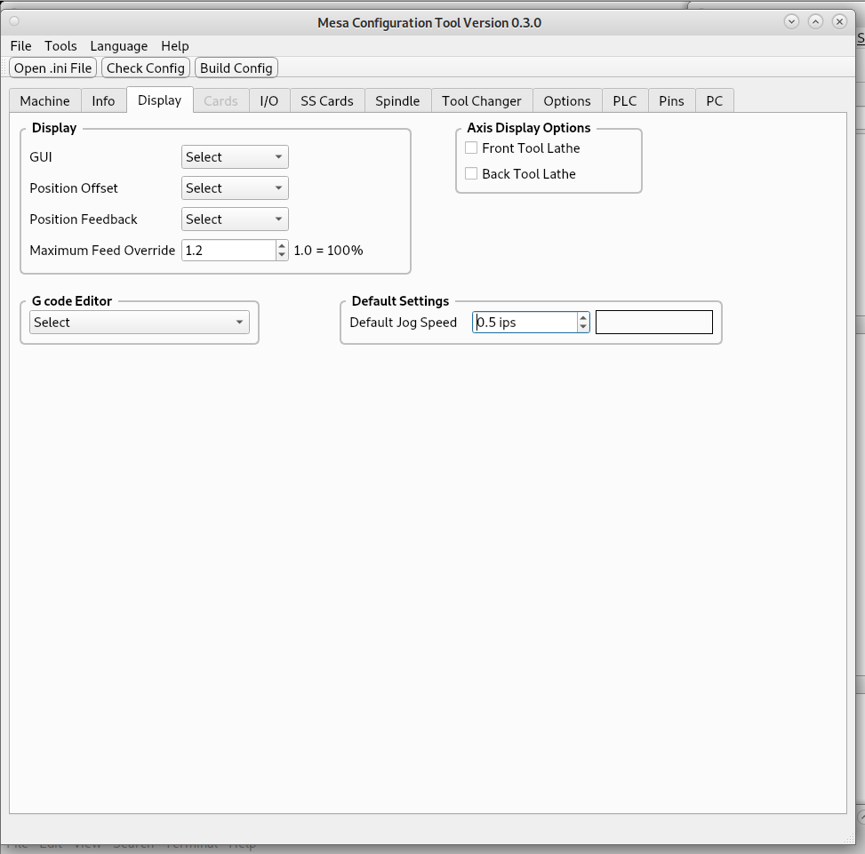

Display Tab
===========

Display Group
-------------

* `GUI` - 
* `Position Offset` - 
* `Position Feedback` - 
* `Maximum Feed Override` - 

* `G code Editor` - 

Axis Display Options
--------------------

* `Front Tool Lathe` - 
* `Back Tool Lathe` - 

Default Settings
----------------

* `Default Jog Speed` - 
