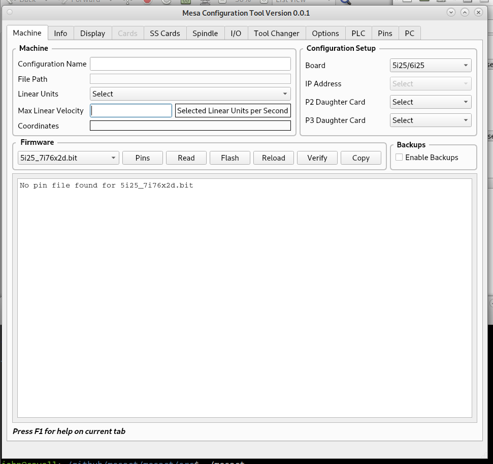

Machine Tab
===========

Machine Group
-------------

* `Configuration Name` - Any letter or number or underscore. Spaces are
	replaced by an underscore.
* `File Path` - Displays the full path to the configuration.
* `Linear Units` - Select base units for the configuration.
* `Max Linear Velocity` - Set the Maximum Linear Velocity for all axes
	combined in Linear Units per second.
* `Coordinates` - Displays the current configuration Coordinates by Axis

Configuration Setup
-------------------

* `Board` - Select the main board being used.
* `IP Address` - If the main board is an Ethernet Board select the IP address of
	the board.
* `Daughter Card` - After selecting the firmware you can select a daugher card
	for which header you're using. The header numbers are added to the Daughter
	Card when a board is selected.

